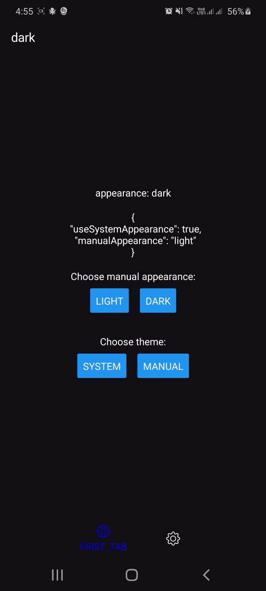
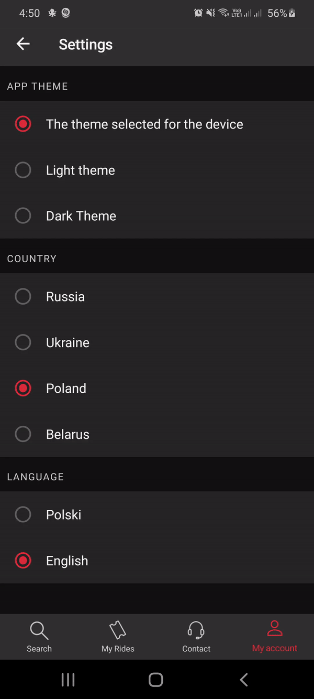

# react-native-navigation-appearance


[](https://www.npmjs.com/package/@busfor/react-native-navigation-appearance)


React Native universal Touchable component.

<div>


</div>

---

## Dependecies

Make sure that your are using supported versions of react-native-navigation and react-native:

| 1.x                                                    |
| ------------------------------------------------------ |
| react-native-navigation >= 6.4.0; react-native: >=0.62 |

## Installation

### Android

#### 1 Install dependencies

Make sure that you have installed `@react-native-community/async-storage` dependency or install it using:

`$ yarn add @react-native-community/async-storage`

Install this module using:

`$ yarn add @busfor/react-native-navigation-appearance`

#### 2 Update `MainActivity.java`

This file is located in `android/app/src/main/java/com/<yourproject>/MainActivity.java`.

```diff
+import android.os.Bundle;
+import androidx.annotation.Nullable;
+import com.busfor.rnnappearance.RNNAppearanceModuleKt;

public class MainActivity extends NavigationActivity {
+  @Override
+  protected void onCreate(@Nullable Bundle savedInstanceState) {
+    super.onCreate(savedInstanceState);
+    RNNAppearanceModuleKt.setThemeResId(R.style.AppTheme);
+  }
}
```

#### 3 Configure android styles.xml

This file is located in `android/app/src/main/res/values/styles.xml`.

```diff
<resources>
+
+    <style name="Theme.AppCompat.DayNight" parent="Theme.AppCompat.Light" />

    <!-- Base application theme. -->
-    <style name="AppTheme" parent="Theme.AppCompat.Light.NoActionBar">
+    <style name="AppTheme" parent="Theme.AppCompat.DayNight.NoActionBar">
        <!-- Customize your theme here. -->
        <item name="android:textColor">#000000</item>
    </style>

</resources>
```

#### 4 Create android night styles.xml

This file should be located in `android/app/src/main/res/values-night/styles.xml`.

```xml
<resources>

    <style name="Theme.AppCompat.DayNight" parent="Theme.AppCompat" />

    <!-- Base application theme. -->
    <style name="AppTheme" parent="Theme.AppCompat.Light.NoActionBar">
    <style name="AppTheme" parent="Theme.AppCompat.DayNight.NoActionBar">
        <!-- Customize your theme here. -->
        <item name="android:textColor">#FFFFFF</item>
    </style>

</resources>
```

### IOS

Make sure you don't have `UIUserInterfaceStyle` in `Info.plist`

## Usage

1. Create a theme with dark and light appearances using `createTheme` function:

```javascript
import { createTheme } from '@busfor/react-native-navigation-appearance'

export const theme = createTheme({
  dark: {
    backgroundColor: '#121212',
    textColor: '#fff',
    primaryColor: 'blue',
  },
  light: {
    backgroundColor: '#fff',
    textColor: '#121212',
    primaryColor: 'red',
  },
})
```

2. Create default options using `createDefaultOptions` function:

```javascript
import { createDefaultOptions, Appearance } from '@busfor/react-native-navigation-appearance'

import { theme } from './theme'

export const defaultOptions = createDefaultOptions(({ appearance }) => ({
  statusBar: {
    style: appearance === Appearance.dark ? 'light' : 'dark',
    backgroundColor: theme[appearance].backgroundColor,
  },
  navigationBar: {
    backgroundColor: theme[appearance].backgroundColor,
  },
  topBar: {
    background: {
      color: theme[appearance].backgroundColor,
    },
    title: {
      color: theme[appearance].textColor,
    },
  },
}))
```

3. Add `ThemeProvider` to register and init module with `defaultOptions` that we have created:

NOTE: Make sure that you are running `initAppearanceModule` inside `Navigation.events().registerAppLaunchedListener` callback and before `Navigation.setRoot` function!

```javascript
import { ThemeProvider, initAppearanceModule } from '@busfor/react-native-navigation-appearance'

Navigation.registerComponent(
  'AppScreen',
  () => (props) => (
    <ThemeProvider>
      <AppScreen {...props} />
    </ThemeProvider>
  ),
  () => AppScreen
)

Navigation.events().registerAppLaunchedListener(async () => {
  await initAppearanceModule(defaultOptions)
  Navigation.setRoot({ ... })
})
```

4. Create screen options using `createOptions` and `defaultOptions` functions:

This file should be located in `/AppScreen/options.js`

```javascript
import { createOptions } from '@busfor/react-native-navigation-appearance'
import { defaultOptions } from '../defaultOptions'

export default createOptions((props) =>
  defaultOptions(props, {
    // props contains the current appearance and passed props to the screen
    topBar: {
      title: {
        text: props.appearance,
      },
    },
  })
)
```

4. Create styles using `createStyles` function:

This file should be located in `/AppScreen/styles.js`

```javascript
import { createStyles } from '@busfor/react-native-navigation-appearance'
import { theme } from '../theme'

export default createStyles(({ appearance }) => ({
  container: {
    flex: 1,
    alignItems: 'center',
    justifyContent: 'center',
    backgroundColor: theme[appearance].backgroundColor,
  },

  text: {
    color: theme[appearance].textColor,
    paddingVertical: 8,
    textAlign: 'center',
  },
}))
```

6. Use `useThemedOptions`, `initialOptions` to define screen options and use `useStyles` hook to provide styles:

This file should be located in `/AppScreen/index.js`

```javascript
import React from 'react'
import { Text, SafeAreaView } from 'react-native'
import { useStyles, initialOptions, useThemedOptions } from '@busfor/react-native-navigation-appearance'

import stylesCreator from './styles'
import options from './options'

const AppScreen = ({ componentId }) => {
  useThemedOptions({}, options, componentId)

  const styles = useStyles(stylesCreator)

  return (
    <SafeAreaView style={styles.container}>
      <Text>Hello world!</Text>
    </SafeAreaView>
  )
}

AppScreen.options = initialOptions(options)

export default AppScreen
```

Also you can open the example project to see how it works in the real case.

## Manual appearance

You can set appearance manually using `useThemeControls` hook:

```javascript
import { useThemeControls, Appearance } from '@busfor/react-native-navigation-appearance'

const App = () => {
  const { setManualAppearance, setUseSystemAppearance } = useThemeControls()

  return (
    <>
      <Button
        title='Dark'
        onPress={() => {
          setManualAppearance(Appearance.dark)
          setUseSystemAppearance(false)
        }}
      />
      <Button
        title='Light'
        onPress={() => {
          setManualAppearance(Appearance.dark)
          setUseSystemAppearance(false)
        }}
      />
      <Button
        title='System'
        onPress={() => {
          setUseSystemAppearance(true)
        }}
      />
    </>
  )
}
```

## Other hooks

### useAppearance

You can get current appearance using `useAppearance` hook:

```javascript
import { useAppearance, Appearance } from '@busfor/react-native-navigation-appearance'

const App = () => {
  const appearance = useAppearance()

  return <Text>Current appearance: {appearance}</Text>
}
```

### useThemedValue

You can get any value for current appearance using `useThemedValue` hook:

```javascript
import { useThemedValue } from '@busfor/react-native-navigation-appearance'

const lightLogoSource = require('./lightLogo.png')
const darkLogoSource = require('./darkLogo.png')

const App = () => {
  const logoSource = useThemedValue({ light: lightLogoSource, dark: darkLogoSource })

  return <Image source={logoSource} />
}
```
